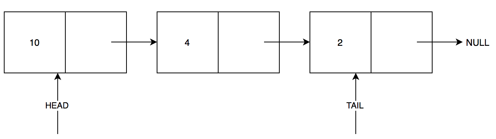
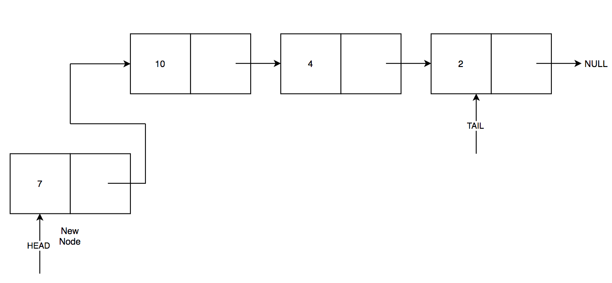
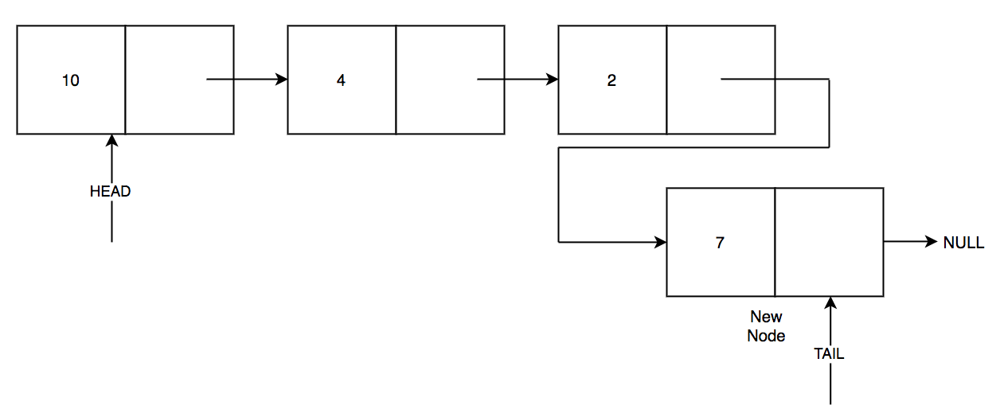
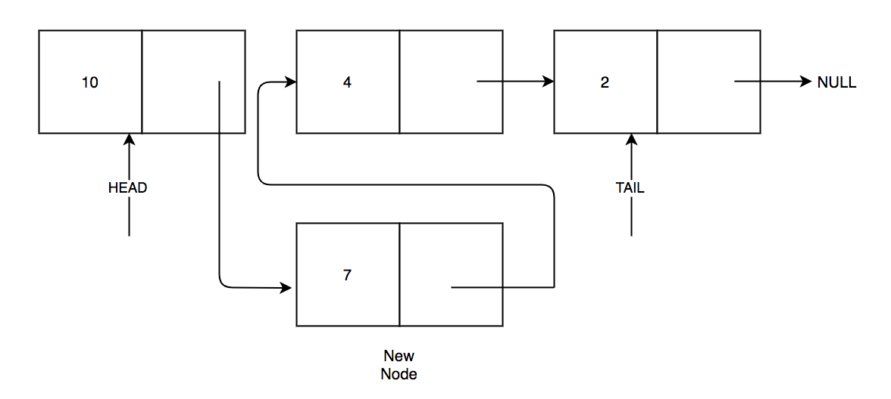
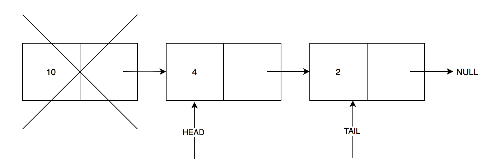
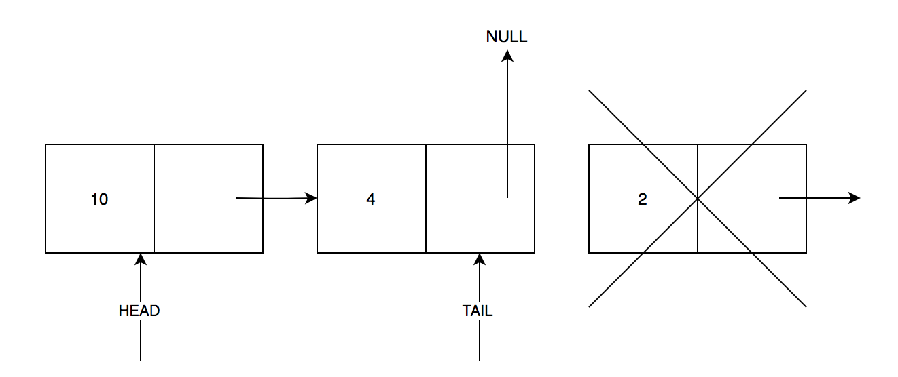
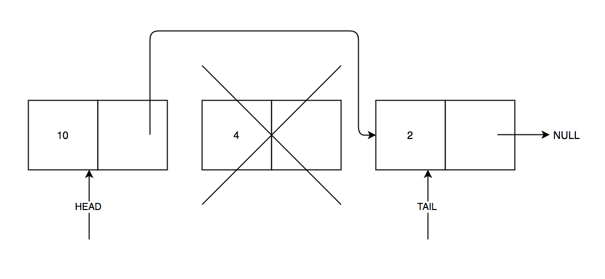

# Singly Linked List: Golang

Singly linked list is a linked list data structure. Each node in a singly linked list has 2 memory location. One to store actual data and another stores the pointer reference to the next node in the list. The mest memory location is called ***Data*** and the next location is called ***Next***. The ***Next*** of the node stores to the memory address of the next node. 

This program is the implementation of Singly Linked List using Golang. The following operations associated with singly linked list is implemented.

1. Adding a node
2. Deleting a node
3. Traversing the list
3. Searching the list

## Adding a Node 

There are 4 types of addition in the list.

1. Add node to the empty list

    To add node at the empty list create a node and add point the next of that node to NULL.

2. Add node at the head 

    

3. Add node at the tail

    

4. Add node in between head and tail

    

## Deleting a Node

The deleteion implemented in this list is deleting the node by the position. We can also delete the node by value. Here, the position of the node that is to be deleted is provided to delete the node. There are 3 types of deletion:

1. Delete the head node

    

2. Delete the tail node

    

3. Delete node between head and tail

    

## Traversing 

This operation is traversing each node in the list and displaying its content. 

## Searching 

The we can also search for the node by passing the value to be searched. The given implementation returns true if the value to be searched is present in the node, else it returns false.
